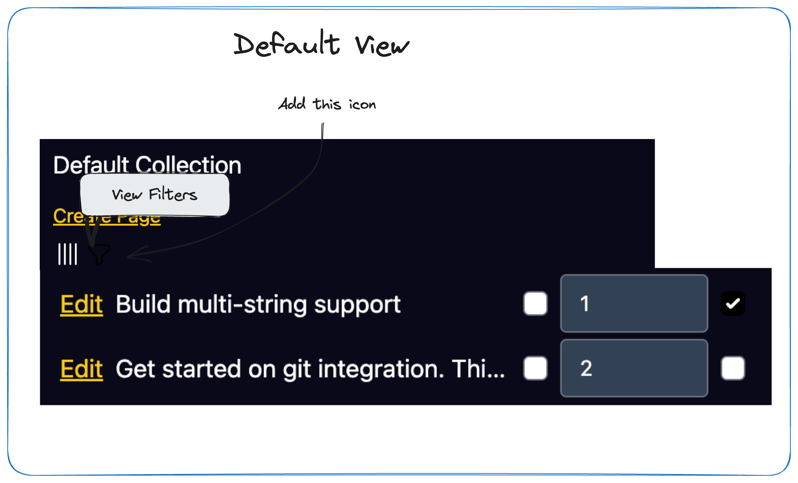
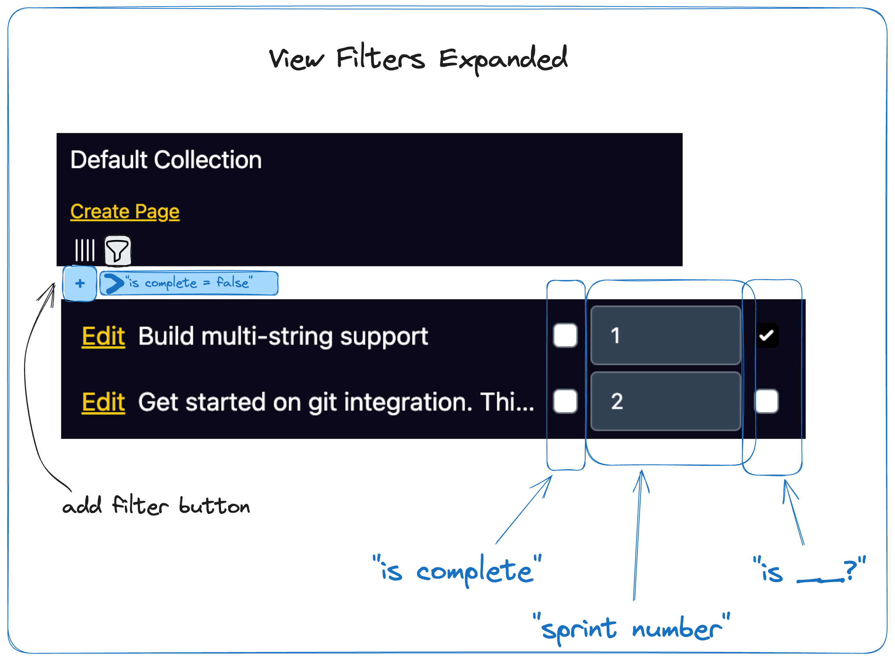
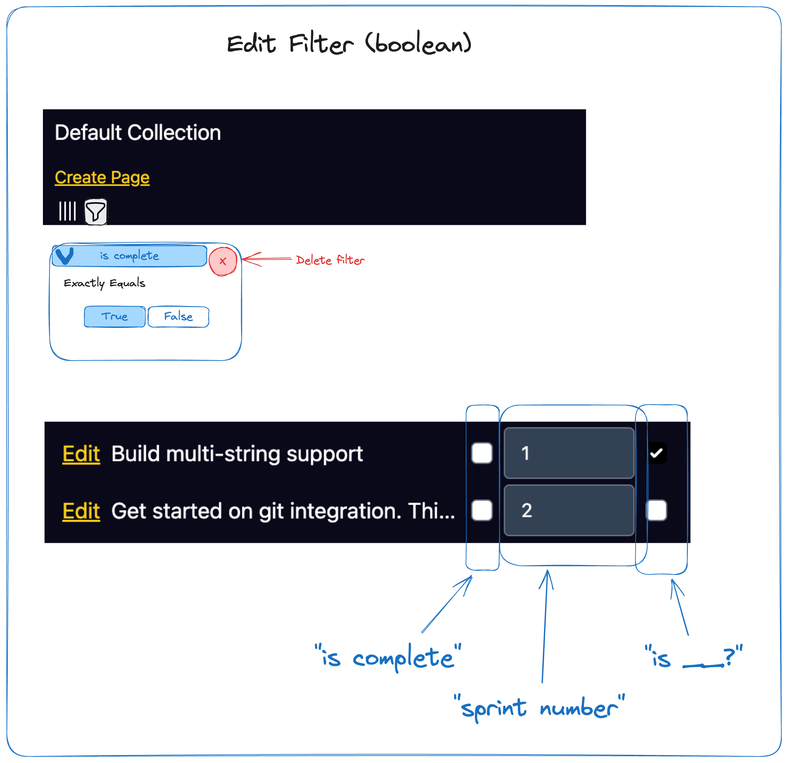
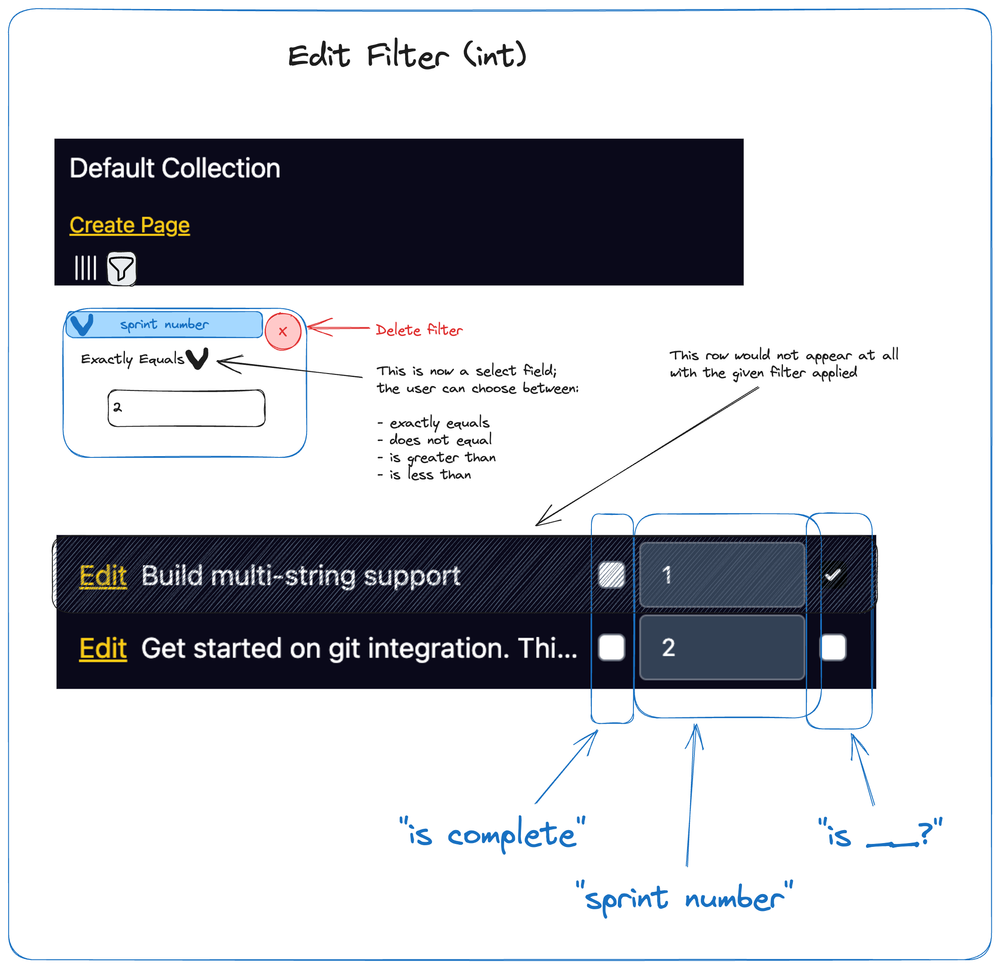
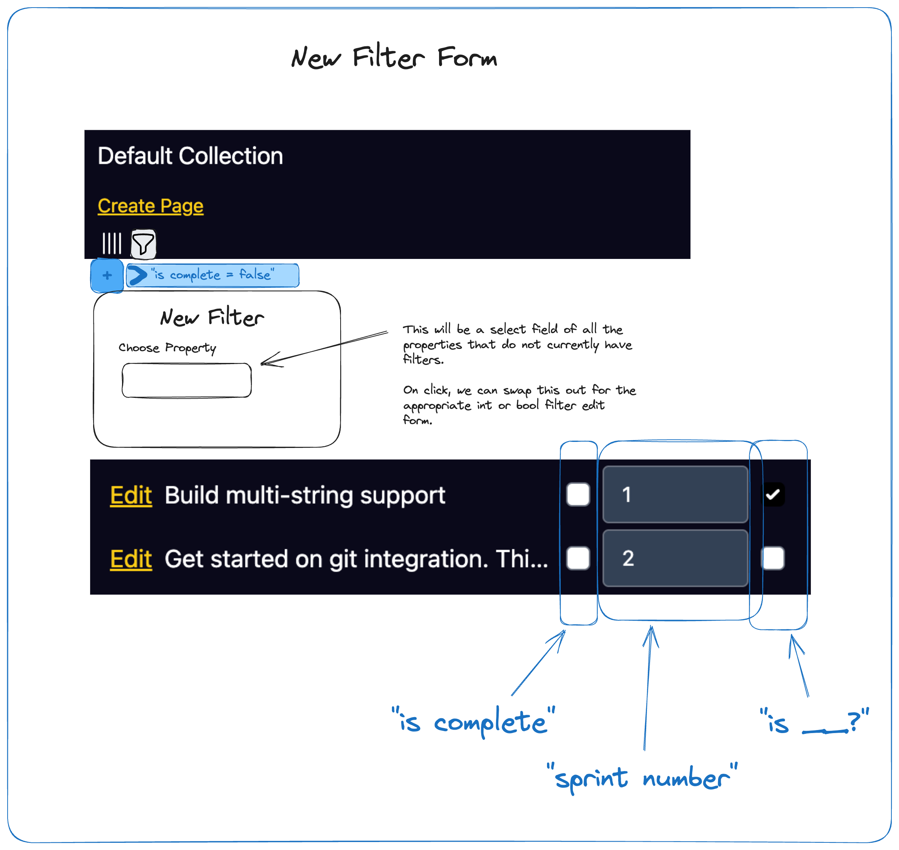

Notion Clone!

Next Steps

1. Filter by arbitrary prop
2. Sort by arbitrary prop
3. Deal with treating db_op error as "Not Found"
  - we're treating DB errors as not found in some cases
  - formally, this ain't correct; maybe DB ops should return a 3-member enum of
    `Found<T>`, `NotFound`, or `Error<E>`
4. Implement float
5. Implement date
6. Implement datetime
7. Implement multistr (tags) 
8. Paginate the collection list view

# Arbitrary Prop Filters

## Stories

- User can filter by any prop
- For boolean props, user can filter for pages where the prop value is true or
  false
- For integer props, we have some filter options:
  - `!=`
  - `==`
  - `<`
  - `>`
  - `range`
- All filters will be `&&`'d together for now.

## Wireframes



We will add a little icon to view filters. Note that Excalidraw isn't outputting
the filter icon for some reason, but it is the generic filter icon from
tailwind heroicons.



When the icon is selected, a small toolbar will appear to show each filter.



Boolean filters can be updated or deleted inline like this. On change, the
filter will save, and then the table will update.



Int filters can be updated or deleted inline like this. Similar on-save behavior
as before.



A new filter can be added in the above workflow.

A special "filter range" type allows us to dodge the complexity of state changes
around having a `<` and `>` filter exist together. It seems elegant to allow the
user to define two filters; "sprint number > 0" and "sprint number > 10."
Together, these of course accomplish the same job as the range filter type.
Except, what happens when the user changes one of the ranges to an `eq` type?
Now, we have "sprint number < 0" and "sprint number = 10." OK, the former filter
is now effectively a no-op. Ideally, we wouldn't want to allow this but it's not
the end of the world. Except, what if the left filter changes as well? Now we
have this state:

```
sprint number == 0
sprint number == 10
```

Oops! Now we're guaranteed to get an empty result-set. That doesn't really make
sense. Thus, allowing an int prop to have only exactly _one_ filter, and adding
the "range filter" type avoids this complexity entirely. Certainly, we might
want to add more complex filter-sets to the app like Notion has, but that's
outside of scope here.

## Schema

```
create table filter_bool(
    id serial primary key,
    collection_id not null references collection(id) on delete cascade,
    prop_id int unique not null references property(id) on delete cascade,
    is_inverted boolean not null,
    value boolean not null
);

create table filter_int(
    id serial primary key,
    collection_id not null references collection(id) on delete cascade,
    prop_id int not null references property(id) on delete cascade,
    value int not null
)
```

## Trait Abstractions & Changes Required

How can we evolve `db_ops::list_pages` to perform these arbitrary queries in a
somewhat sustainable way while also pushing the real filtering into the database
as `WHERE` clauses?

Is there a way to implement this that maintains compile-time type-safety by
using SQLx `query_as!` macro?

### `query_as!`-only Approach

First, I can do a `query_as!` to get all the filters.

```
let int_filters = query_as!("select value from filter_bool ...");
let bool_filters = query_as!("select value from filter_int ...");
```

But then, I can't see how those can reduce into a single `query_as!` call.

### Maintain Current Double-Query

I like the current 2-query approach where we do one preliminary query to get the
set of pages we will display, and then a follow-up to get all the props.
However, I can't see how we can maintain this approach now. The need to
filtering means that property values affect the set of pages we will need to
display. That first query would presumably become bloated by all the filtering
and sorting logic to an extent that we may as well left-join all the property
values and forego the 2-query approach entirely.

That being said, maintaining the 2-query approach might look like this:

```
select p.id, p.title, from page p

-- There may be many joins onto the bool table for each bool prop, qualified
-- by a filter in the join on prop id. This way, we append columns for each
-- prop instead of introducing row duplication.
left join propval_bool pv-{$1} on pv.page_id = p.id and prop_id = $1
--                        ^^^^ we will need smart aliases

-- Similar story for the ints...
left join propval_int pi-{$2} on pi.page_id = p.id and prop_id = $2

where p.collection_id = $3
```

This gives us a set of pages which we can then go and get properties for, but it
seems just as complicated as doing the whole thing in a single query.


One advantage here, though, is that performance (and amount of joins) in the
above query will depend on the quantity of filters and sorts, whereas an
all-in-one-go query will degrade in performance with the size of the collection
and the properties. In other words, this could be a cheaper initial-page-load
query in typical cases

### Left Join yet Heart Out

I think this unfortunately makes the most sense.

- we will need a left join for each prop in the collection
- we will need dynamically computed alias names (need to confirm how to do that
  in SQLx)
  - we can use `.push` --
    https://docs.rs/sqlx/latest/sqlx/struct.QueryBuilder.html#method.push.
    This does not protect from SQL injection, but if we use the ID of the
    filter, which is known to be safe & generated by out system, this should be
    OK. I confirmed that a raw integer cannot be used as a table alias in
    PostgreSQL, but an int concatenated with a string works (i.e, `23` does not
    work, but `pv23` does work.
- we will still need an up-front query for the filters (and later sorts) before
  the main query, introducing initial-page-load latency. I think that we can
  improve this later by adding an in-memory cache.

Also, I did a little dynamic alias experiment to make sure this works like I
expect and it appears it does:

```diff
diff --git a/src/db_ops.rs b/src/db_ops.rs
index 10e6fb4..7fbfa46 100644
--- a/src/db_ops.rs
+++ b/src/db_ops.rs
@@ -261,16 +261,19 @@ impl DbModel<GetPropQuery, ListPropQuery> for models::Prop {
         Ok(raw_prop.into_prop())
     }
     async fn list(db: &PgPool, query: &ListPropQuery) -> Result<Vec<Self>> {
+        let alias = String::from("foo123");
         let mut builder: QueryBuilder<Postgres> = QueryBuilder::new(
             r#"select id, type_id, collection_id, name, "order"
             from property "#,
         );
 
-        builder.push("where collection_id = ");
+        builder.push(format!("as {alias} "));
+
+        builder.push(format!("where {alias}.collection_id = "));
         builder.push_bind(query.collection_id);
 
         if let Some(order_set) = &query.order_in {
-            builder.push(r#" and "order" in ("#);
+            builder.push(format!(r#" and {alias}."order" in ("#));
             let mut sep = builder.separated(",");
             for o in order_set {
                 sep.push_bind(o);
@@ -278,6 +281,13 @@ impl DbModel<GetPropQuery, ListPropQuery> for models::Prop {
             builder.push(")");
         };
 
+        // It works!
+        //
+        //     select id, type_id, collection_id, name, "order"
+        //     from property as foo123 where foo123.collection_id = $1
+        //
+        println!("{}", builder.sql());
+
         let mut raw_props =
             builder.build_query_as::<QresProp>().fetch_all(db).await?;

```

Obviously, we are getting into SQL injection risk territory, where our security
model now assumes that `model.id` is safe. Now, I figure that Rust's type-system
has our back here. Even if the user is able to get an `id` of their own into one
of our structs, IDs are ultimately `i32`, so it should be impossible to perform
SQL injection through this attack vector.

# Other Future Ideas

- I would like middleware to minify and compress outgoing HTML
- it would be nice to order filters by creation date... currently, the order in
  the toolbar is basically nondeterministic; though in practice they'll appear
  first sorted by type and secondarily sorted by order of creation, which is
  fine, I suppose
- hover tooltips are gross; we can do a better implementation with a bit of JS
- we need to query for filters and sorts before the main query for initial page
  load. An in-memory cache for all collection filters and sorts would be awesome
  for maximally taking advantage of our architecture and also improving initial
  page load times.
- add `NULL` instead of giving every data-type an implicit default; accordingly
  add "is empty" / "is not empty" filters
- make column ordering more robust
- add support for transactions to DbModel
  - we can probably achieve this with:
    ```
    enum Db {
      Db(&PgPool),
      Tx(Transaction<Postgres>)
    }
    ```
- improve UX around hover-tooltip-icons on mobile by changing them to a button
  with the icon and text

# Completed Steps

1. (done) Page Insertion
2. (done) Lazy propval init
  - inserted pages will not have any rows in propvals
  - logic for rendering the overview needs to figure out how to deal with that
3. (done) Page overview
  - where page content can be edited
  - markdown time!
4. (done) Customizable column ordering
